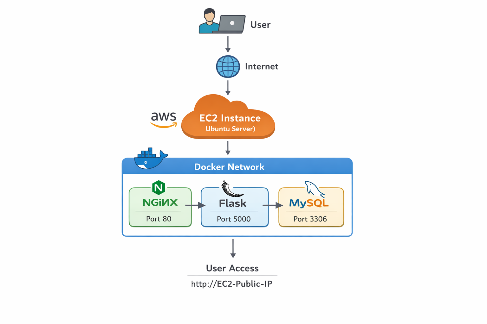

# 🚀 Flask DevOps 3-Tier Application

## 📌 Project Overview

This project demonstrates a production-style DevOps workflow by deploying a containerized Flask application using a **3-tier architecture** with NGINX, Flask, and MySQL.

---

## 🧱 Architecture

User → NGINX → Flask → MySQL

* **NGINX** → Reverse proxy (entry point)
* **Flask** → Backend application logic
* **MySQL** → Database

## 🏗️ Architecture Diagram



## ⚙️ Tech Stack

* Python (Flask)
* MySQL
* Docker & Docker Compose
* NGINX
* GitHub Actions (CI/CD)
* AWS EC2 (Deployment)

---

## 🚀 Features

* 3-tier architecture
* Reverse proxy using NGINX
* Multi-container setup with Docker Compose
* Service-to-service communication using Docker network
* MySQL database integration
* Health check endpoint (`/health`)
* Login & Register functionality
* CI/CD pipeline with GitHub Actions

---

## 📂 Project Structure

```
.
├── app.py
├── Dockerfile
├── docker-compose.yml
├── nginx/
│   └── conf/nginx.conf
├── templates/
└── .github/workflows/ci.yml
```

---

# 🧩 Application Code

## 🔹 app.py

```python
from flask import Flask, render_template, request
import mysql.connector
import time

app = Flask(__name__)

while True:
    try:
        db = mysql.connector.connect(
            host="mysql",
            user="root",
            password="root",
            database="testdb"
        )
        print("Connected to MySQL ✅")
        break
    except Exception as e:
        print("Waiting for MySQL...", e)
        time.sleep(2)

@app.route('/')
def home():
    return render_template("index.html")

@app.route('/register', methods=['POST'])
def register():
    username = request.form['username']
    password = request.form['password']

    cursor = db.cursor()
    cursor.execute(
        "INSERT INTO users (username, password) VALUES (%s, %s)",
        (username, password)
    )
    db.commit()
    return "User Registered ✅"

@app.route('/login', methods=['POST'])
def login():
    username = request.form['username']
    password = request.form['password']

    cursor = db.cursor()
    cursor.execute(
        "SELECT * FROM users WHERE username=%s AND password=%s",
        (username, password)
    )
    user = cursor.fetchone()

    if user:
        return "Login Successful ✅"
    else:
        return "Invalid Credentials ❌"

@app.route('/health')
def health():
    return {"status": "ok"}, 200

if __name__ == '__main__':
    app.run(host='0.0.0.0', port=5000)
```

---

## 🔹 templates/index.html

```html
<!DOCTYPE html>
<html>
<head>
    <title>Flask DevOps App</title>
</head>
<body>

<h2>Register</h2>
<form action="/register" method="POST">
    <input name="username" placeholder="Username" required><br><br>
    <input name="password" type="password" placeholder="Password" required><br><br>
    <button type="submit">Register</button>
</form>

<hr>

<h2>Login</h2>
<form action="/login" method="POST">
    <input name="username" placeholder="Username" required><br><br>
    <input name="password" type="password" placeholder="Password" required><br><br>
    <button type="submit">Login</button>
</form>

</body>
</html>
```

---

# 🧩 DevOps Configuration

## 🔹 Dockerfile

```dockerfile
FROM python:3.9

WORKDIR /app

COPY . .

RUN pip install flask mysql-connector-python

CMD ["python", "app.py"]
```

---

## 🔹 docker-compose.yml

```yaml
services:
  nginx:
    image: nginx:latest
    ports:
      - "8080:80"
    volumes:
      - ./nginx/conf/nginx.conf:/etc/nginx/conf.d/default.conf
    depends_on:
      - flask

  flask:
    build: .
    expose:
      - "5000"
    depends_on:
      - mysql

  mysql:
    image: mysql:5.7
    restart: always
    environment:
      MYSQL_ROOT_PASSWORD: root
      MYSQL_DATABASE: testdb
    ports:
      - "3306:3306"
```

---

## 🔹 nginx/conf/nginx.conf

```nginx
server {
    listen 80;

    location / {
        proxy_pass http://flask:5000;
        proxy_set_header Host $host;
        proxy_set_header X-Real-IP $remote_addr;
    }
}
```

---

## 🔹 CI/CD Pipeline (.github/workflows/ci.yml)

```yaml
name: CI Pipeline

on:
  push:
    branches:
      - main

jobs:
  build-and-test:
    runs-on: ubuntu-latest

    steps:
      - uses: actions/checkout@v3

      - name: Build Docker image
        run: docker build -t flask-devops-app .

      - name: Run container
        run: docker run -d -p 5000:5000 flask-devops-app

      - name: Wait for app
        run: sleep 10

      - name: Health check
        run: curl http://localhost:5000/health
```

---

# 🧩 Database Setup

```sql
CREATE DATABASE IF NOT EXISTS testdb;

USE testdb;

CREATE TABLE users (
    id INT AUTO_INCREMENT PRIMARY KEY,
    username VARCHAR(100),
    password VARCHAR(100)
);
```

---

# 🛠️ Setup Instructions

```bash
git clone https://github.com/jayy-sanju/devops-flask-app.git
cd devops-flask-app
docker compose up --build
```

---

# 🌐 Access Application

```
http://localhost:8080
```

---

# 🔄 Evolution

This project was initially built as a **2-tier architecture** and later upgraded to a **3-tier architecture using NGINX**, improving scalability and separation of concerns.

---

# 🧠 Key Learnings

* Docker containerization
* Multi-container orchestration
* Reverse proxy using NGINX
* Docker networking
* Debugging container failures
* CI/CD pipelines
* Cloud deployment basics

---

# 🔥 Future Improvements

* AWS RDS integration
* Docker Hub / ECR image push
* Load balancing
* Terraform automation
* HTTPS (SSL)
* Kubernetes deployment


